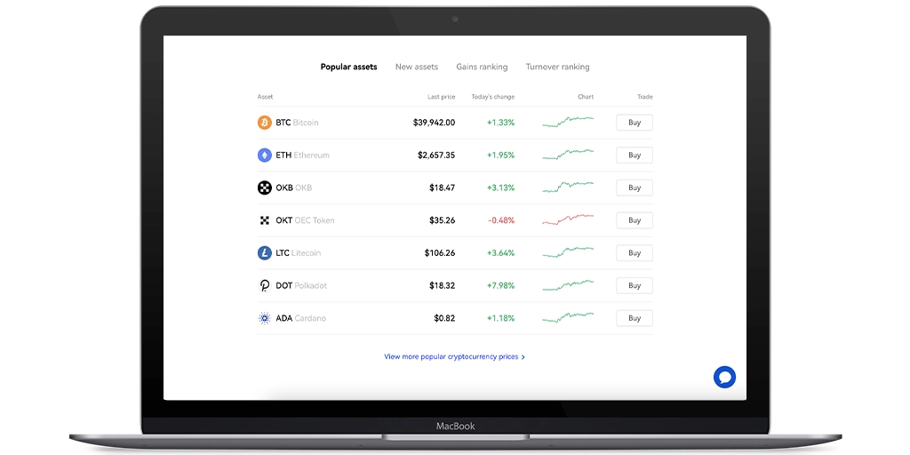

# OKX Exchange | In-Depth Review – Pros and Cons

You're probably wondering if OKX is actually worth your time, right? Look, I get it—there are a million crypto exchanges out there, and most of them promise the moon but deliver… well, not much. But here's the thing about OKX: it's been around since 2017, has over 20 million users across 100+ countries, and just became the official crypto partner of Manchester City FC. That's not nothing. Whether you're a complete beginner trying to buy your first Bitcoin or a seasoned trader looking for advanced derivatives, OKX has something for you. No fluff, no BS—just a solid platform that actually works. In this review, we'll break down exactly what OKX offers, how secure it is, what it costs, and whether it's the right exchange for your needs.

---

Founded in 2017, OKX (formerly OKEx) has its headquarters registered in the Seychelles with offices scattered worldwide. This is the 15th largest cryptocurrency exchange by volume, serving over 20 million users from more than 100 countries.

This platform offers a ton of services like trading, staking, mining pools, crypto loans, an NFT marketplace, and much more. In this OKX review, we'll explore its services, security, fees, customer support, pros and cons, and everything else you need to know.

## OKX & Partnership with Manchester City

In March 2022, OKX announced its partnership with the famous Manchester City FC of the English Premier League, becoming its official "Crypto Exchange Partner."

## Regions/Nations Where OKX Has Restrictions

OKX.com is a global cryptocurrency platform available in over 100 countries worldwide, but it doesn't provide its services to users from: Bangladesh, Bolivia, Crimea, Cuba, Ecuador, Hong Kong, Kyrgyzstan, Malaysia, North Korea, Sudan, Syria, and the United States (and other American territories).

## Is OKX a Safe Cryptocurrency Exchange?

To protect its users, OKX Exchange uses advanced security features, including:

**Multi-signature hot wallet** – The private keys of each user's OKX hot wallet are managed by 3 separate private key managers in different geographic locations.

**Mandatory two-factor authentication** – To withdraw funds and access accounts, OKX requires users to enable two-factor authentication (2FA) via Google Authenticator.

**Anti-phishing code** – Users can enable the anti-phishing feature so that OKX's system sends a code to the user's email address.

**Cold storage** – OKX stores 95% of all cryptocurrencies in "cold storage" deposits not connected to the Internet. Additionally, for extra security, the private keys of these deposits are stored in different geographic locations.

**Fund password** – OKX allows users to set a password. This way, with each withdrawal, the system will ask the user for the password before continuing the operation.

Unlike many other similar sites that have been hacked, OKX has never been breached, giving you the confidence to use a secure and protected cryptocurrency exchange.

## Cryptocurrencies Available on OKX

Currently, there are over 350 cryptocurrencies available on OKX, including trading pairs, with the main ones traded by volume being:

Bitcoin, OKB, Terra, Solana, Polygon, Ethereum, TRON, Avalanche, APENFT, JUST, XRP, Dogecoin, Polkadot, Shiba Inu, and more!

The list is truly immense, so check it on OKX's website—there are really too many to list them all here!

## OKX Services

The products offered by OKX are really numerous and include: trading, margin trading, options trading, perpetual swaps, and spot trading. In this section, we'll analyze everything this site has to offer.

### Cryptocurrency Exchange on OKX

For beginners, the best starting point is OKX Exchange. In this section, you can buy more than 30 cryptocurrencies. Its interface is simple and intuitive, perfect if you want to buy Bitcoin, Ethereum, Solana, or any other major currency for the first time.

Once you've purchased one of these 30+ cryptocurrencies, you can use OKX's converter to exchange it for another of the 300 available cryptocurrencies.

### Margin Trading on OKX

OKX offers margin trading with industry-standard leverage up to 1:20, and while margin trading on this platform, you can choose from 3 modes: single currency, multi-currency, and portfolio.

Although high leverage rates will attract many traders, margin trading can be risky, so use a careful approach to risk management. (OKX also offers a free demo trading account where users can use virtual money to create strategies without losing real money. Take advantage of it!)

### Advanced Trading on OKX

When you've gotten used to margin trading, you can move to advanced markets using the futures trading, perpetual swap, and options features provided by OKX.

For traders interested in advanced trading products, OKX collects useful data in an easy-to-understand format with the latest prices, volumes, and lots of other useful information.

## OKX Wallet

Every user can register an account and use the OKX wallet integrated into the platform, where you can safely store your cryptocurrencies or move them to the trading platform for more advanced trading.

👉 [Want to start trading with one of the most secure crypto exchanges? Join OKX now and explore over 350 cryptocurrencies](https://www.okx.com/join/47044926)

## MetaX Wallet

OKX MetaX Wallet is a private and easy-to-use decentralized wallet that allows users to store their cryptocurrencies, tokens, and more. MetaX is a smart wallet that supports multichain functions working on more than 15 blockchains and 1,000 DeFi protocols.

With the MetaX Wallet, users can completely control their cryptocurrencies using their private keys. Here are the advantages of using MetaX:

**One-stop solution** – No more incompatibilities between different DEXs (decentralized exchanges)

**DApp store** – Explore over 1,000 DApps (decentralized apps) with one click

**NFT Marketplace** – Create, manage, trade, and sell NFTs (non-fungible tokens)

## NFT Market on OKX

As already mentioned, using the MetaX Wallet gives you access to the NFT Marketplace where you can create, collect, and trade extraordinary NFT assets. Below we list what you can do on OKX regarding the NFT area:

**Access certified high-level collections** – The MetaX NFT Market includes curated collections from the best artists, game developers, and celebrities, including many limited edition exclusives!

**Mint your NFT** – Minting (or creating) your NFTs on OKX will cost very little compared to what you'll pay on the Ethereum network. Additionally, the MetaX Market supports all OEC NFTs and allows you to mint new NFTs in a few simple steps. Finally, you can sell the NFTs you create to earn big!

## OKX Exchange – The OKB Token

The OKB token is the proprietary currency issued by OKX's OK Blockchain Foundation, very similar to Binance's BNB and KuCoin's KCS. Using OKB on the platform will give you these advantages:

- Discounts on trading fees
- Earn passive income
- Get special token sales
- Take advantage of the OKXChain ecosystem

OKX regularly burns OKB tokens to reduce supply. OKX uses 30% of OKX trading fee revenue to buy back OKB from the 300 million OKB in circulation, increasing its value and encouraging you to own even more tokens!

## OKX Mobile App for iOS and Android

OKX's mobile apps are perfect for traders who want to trade on the go and aren't at their computer. They're available for both Android and iOS devices, are undoubtedly well-designed and easy to use, and have all the features of the web platform.

## OKX Exchange KYC Verification Requirements

On OKX, you can use a phone number or email address to create an account, but after doing so, know that this platform has 4 different account verification levels. (Higher levels give you access to a higher number of features)

**Unverified** – Accounts without verification are limited and, among other things, can only withdraw 10 BTC per day.

**Level One** – You must enter your nationality, name, and submit an identity document, and the withdrawal limit will increase to 200 BTC per day.

**Level Two** – This verification step requires you to verify your identity with a photograph and will increase the withdrawal limit to 500 BTC per day.

**Level Three** – This verification level requires you to read and accept OKX's disclaimer from the mobile app (or website) after the 2 previous steps. You'll have the same daily BTC withdrawal limit as Level Two, but the cumulative P2P transaction limit will increase to $100,000.

For almost all exchanges, trading fees are 0.1% for makers and 0.08% for takers. However, if you're a VIP user (monthly trading volume over $10 million USD), fees will start at 0.06%. Remember, however, that the amount of your OKB holdings will affect fees.

Volume discounts are granted to more active users with a minimum 30-day trading volume of $10 million USD:

| LEVEL | 30-DAY TRADING VOLUME | MAKER FEE | TAKER FEE |
|-------|----------------------|-----------|-----------|
| VIP 1 | ≥ $10,000,000 | 0.080% | 0.060% |
| VIP 2 | ≥ $20,000,000 | 0.075% | 0.040% |
| VIP 3 | ≥ $50,000,000 | 0.070% | 0.020% |
| VIP 4 | ≥ $100,000,000 | 0.060% | 0.000% |
| VIP 5 | ≥ $200,000,000 | 0.050% | -0.002% |
| VIP 6 | ≥ $500,000,000 | 0.040% | -0.005% |
| VIP 7 | ≥ $1,000,000,000 | 0.030% | -0.010% |
| VIP 8 | ≥ $10,000,000,000 | 0.025% | -0.010% |

## Payment Methods on OKX and Fees

If you don't own cryptocurrencies, you can buy them directly from OKX.com using GBP, USD, EUR, JPY, or other fiat currencies. The exchange offers various payment methods including Apple Pay, Visa, Mastercard, and bank transfer. Remember, however, that it's the payment service provider that will charge you the real money transaction fee (usually 1%–3%), not OKX.

### Deposit on OKX and Fees

In the OKX wallet, you can deposit over 350 cryptocurrencies without paying fees. Just go to Menu, click "Deposit," and choose the cryptocurrency you want to deposit.

### Withdrawal on OKX and Fees

Depending on the crypto you withdraw on OKX, fees will also change. For example, fees for Bitcoin are 0.0002 BTC and for Ethereum are 0.004 ETH. These are standard fees (actually lower compared to other well-known similar sites), so you can freely withdraw as much as you want, whenever you want.

## OKX Customer Service

If you have questions, you can consult the many articles in the Help Center. However, if these aren't enough, OKX provides an AI chatbot and the following contact methods.

Although OKX isn't one of the top 10 cryptocurrency exchanges in the world, it's still popular and offers many excellent services. The advantages of OKX are:

**✅ A trustworthy exchange with a sports partnership!**

**✅ Buy, sell, and trade over 350 cryptocurrencies!**

**✅ KYC (know your customer) is not mandatory!**

**✅ Very low trading fees for regular users!**

**✅ MetaX Wallet that allows you to create, buy, and sell NFTs!**

Additionally, OKX also offers exceptionally high returns for staking. Overall, OKX isn't the largest exchange, but it's a secure platform for all your cryptocurrency needs, so we highly recommend it!

## Frequently Asked Questions About OKX Exchange

**Is OKX exchange a scam? Will investors be scammed?**

Absolutely not. For years, OKX has been one of the leading cryptocurrency platforms and is known by millions of users worldwide, so you won't be scammed on it.

**What does OKX offer?**

OKX offers a spot exchange, a trading platform, a crypto lending service, an NFT marketplace, and much more. In fact, other new services will be added soon!

**What is the minimum deposit on OKX?**

The minimum deposit is €/$0. OKX exchange is an easy-to-use cryptocurrency platform that allows users to invest and trade with a small deposit.

**What are the withdrawal methods on OKX?**

OKX exchange allows easy withdrawals via Visa, bank transfers, and popular cryptocurrencies like Bitcoin, Ethereum, Dogecoin, Solana, and Monero.

**Does OKX require KYC (Know Your Customer)?**

OKX exchange doesn't require users to complete the KYC process, although it's necessary to use all the tools and features.

**Will I lose money on OKX Exchange?**

OKX can't cheat you or make you lose money. The fluctuating price of the cryptocurrencies you buy or trade will affect the value of your assets.

**Can I make money with OKX Exchange?**

Of course you can. You'll need commitment (and a bit of luck), but know that many investors and traders have made a lot of money on OKX. Find your favorite cryptocurrency now and get rich!

---

So there you have it—a complete breakdown of OKX Exchange. Bottom line? It's a solid, secure platform with low fees, tons of cryptocurrencies, and features for everyone from beginners to pros. The partnership with Manchester City adds legitimacy, the security measures are top-notch, and the MetaX wallet opens up the whole NFT world. Sure, it's not the biggest exchange out there, but sometimes that's actually better—less crowded, more focused on what matters. If you're looking for a reliable crypto exchange that won't nickel-and-dime you with fees and actually delivers on its promises, OKX is definitely worth checking out.
